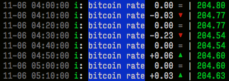

a [’cause](https://github.com/freder/cause) building block, that 
- retrieves the current bitcoin rate from [https://api.bitcoinaverage.com/exchanges](https://api.bitcoinaverage.com/exchanges)
- logs price and difference to the console

